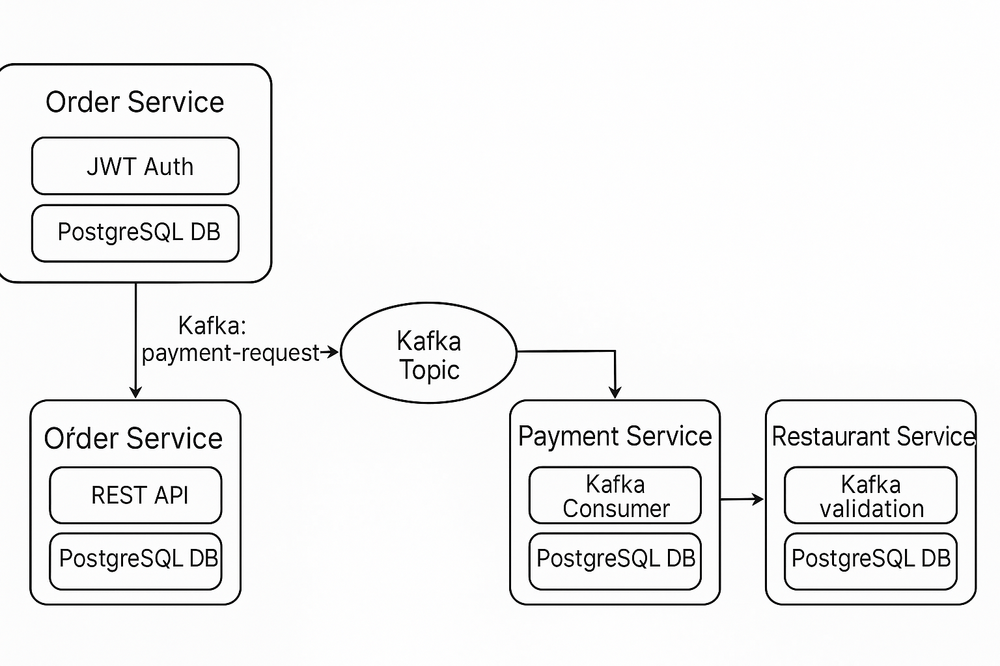

# Food Ordering System

[](https://www.oracle.com/java/technologies/javase/jdk17-archive-downloads.html)


## Table of Contents

- [Overview](#overview)
- [Features](#features)
- [Architecture](#architecture)
- [Technologies Used](#technologies-used)
- [Project Structure](#project-structure)
- [Installation and Setup](#installation-and-setup)
- [Usage](#usage)
    - [API Endpoints](#api-endpoints)
    - [Sample Request](#sample-request)
- [Data Flow](#data-flow)
- [Development Guidelines](#development-guidelines)
    - [Adding a New Feature](#adding-a-new-feature)
    - [Testing](#testing)
- [Contributing](#contributing)
- [License](#license)
- [Contact](#contact)

## Overview

This project is a backend system for a food ordering app designed around a microservices architecture. The goal was to model how real-world platforms like Uber Eats or DoorDash might handle things like placing orders, processing payments, managing restaurant approvals, and handling customer data.

Everything is written in Java (using Spring Boot), and the services talk to each other asynchronously using Kafka. To make communication reliable, I implemented the Outbox pattern, so messages won’t get lost if something fails.

To bring it to life in the cloud, I used Terraform to deploy the system to AWS. The services run in Docker containers on EC2, PostgreSQL hosted on RDS, and Kafka takes care of async communication between services using the Outbox pattern for reliability.

## Features

- **Order Management**: Place, track, and manage food orders.
- **Payment Processing**: Secure and reliable payment transactions.
- **Restaurant Interface**: Restaurants can approve or reject orders.
- **Customer Profiles**: Manage customer information and order history.
- **Real-Time Notifications**: Updates via Apache Kafka messaging.
- **Reliable Messaging with Outbox Pattern**: Ensures consistent and reliable message delivery between services.

## Architecture

This project uses a Hexagonal Architecture (Ports and Adapters) with Domain-Driven Design. Each service has clear boundaries and is structured like this:

- **Domain Layer**: All the core business logic and domain entities
- **Application Layer**: Use cases and services
- **Infrastructure Layer**: Databases, Kafka, and cloud interactions
- **Outbox Pattern Implementation**: Ensures reliable communication between microservices by showing messages in an outbox table in the database and then publishing them to the message broker.



## Tech Stack

- **Java 17**, Spring Boot, Spring Data JPA, Spring Transactions
- **Apache Kafka** for messaging
- **PostgreSQL** (via AWS RDS Free Tier)
- **Docker** to containerize microservices
- **Terraform** to automate AWS infrastructure setup (EC2, RDS)
- **Maven** for building everything

## Project Structure

The project is modularized, reflecting its microservices architecture:

### Common Modules

- **`common`**: Shared utilities and code across microservices.
- **`infrastructure`**: Infrastructure components like Kafka configurations and Outbox pattern implementations.

### Microservice Modules

Each microservice comprises:

- **`domain`**: Domain models and core business logic.
- **`application`**: Application services and use cases.
- **`dataaccess`**: Data repositories and database interactions.
- **`messaging`**: Kafka producers and consumers.
- **`outbox`**: Components related to the Outbox pattern for reliable message handling.
- **`container`**: Spring Boot application entry point.

## Installation and Setup

### Prerequisites

- **Java Development Kit (JDK) 17**
- **Maven**
- **Docker & Docker Compose**

### Steps

1. **Clone the repository**

   ```bash
   git clone https://github.com/sogutemir/FoodOrderingSystem.git
   ```

2. **Navigate to the Project Directory**

   ```bash
   cd FoodOrderingSystem
   ```

3. **Build the project**

   ```bash
   mvn clean package
   ```

4. **Start Kafka and Zookeeper**

   Ensure that Docker is running, then start the required services:

   ```bash
   docker-compose -f common.yml -f init_kafka.yml up -d
   docker-compose -f common.yml -f kafka_cluster.yml up -d
   docker-compose -f common.yml -f zookeeper.yml up -d
   ```

5. **Run the services**

   Open separate terminals for each microservice and run:

   ```bash
   # Order Service
   java -jar order-service/order-container/target/order-container-1.0-SNAPSHOT.jar

   # Payment Service
   java -jar payment-service/payment-container/target/payment-container-1.0-SNAPSHOT.jar

   # Restaurant Service
   java -jar restaurant-service/restaurant-container/target/restaurant-container-1.0-SNAPSHOT.jar

   # Customer Service
   java -jar customer-service/customer-container/target/customer-container-1.0-SNAPSHOT.jar
   ```

## Usage

### API Endpoints

The application exposes RESTful APIs for interaction. Here are some of the key endpoints:

- **Order Service**
    - Create Order: `POST /orders`
    - Get Order Details: `GET /orders/{orderId}`
    - Update Order: `PUT /orders/{orderId}`
    - Delete Order: `DELETE /orders/{orderId}`
- **Payment Service**
    - Process Payment: `POST /payments`
- **Restaurant Service**
    - Approve Order: `POST /restaurants/{restaurantId}/orders/{orderId}/approve`
    - Reject Order: `POST /restaurants/{restaurantId}/orders/{orderId}/reject`
- **Customer Service**
    - Register Customer: `POST /customers`
    - Get Customer Info: `GET /customers/{customerId}`

### Sample Request

**Create Order**

**Endpoint:** `POST http://localhost:8181/orders`

**Headers:**

- `Content-Type: application/json`

**Request Body:**

```json
{
  "customerId": "d215b5f8-0249-4dc5-89a3-51fd148cfb41",
  "restaurantId": "d215b5f8-0249-4dc5-89a3-51fd148cfb45",
  "address": {
    "street": "Main Street",
    "postalCode": "12345",
    "city": "Amsterdam"
  },
  "price": 200.00,
  "items": [
    {
      "productId": "product-1",
      "quantity": 1,
      "price": 50.00,
      "subTotal": 50.00
    },
    {
      "productId": "product-2",
      "quantity": 3,
      "price": 50.00,
      "subTotal": 150.00
    }
  ]
}
```

**Response:**

```json
{
  "orderId": "order-123",
  "status": "PENDING",
  "message": "Order created successfully."
}
```

For detailed API documentation, refer to the [API Documentation](https://github.com/sogutemir/FoodOrderingSystem/wiki).

## Data Flow

1. A customer places an order via the Order Service
2. An event is logged to the Outbox table (inside the same DB transaction)
3. The system publishes the event to Kafka
4. The Payment Service listens to the event and processes the payment
5. Once payment is confirmed, the Restaurant Service approves the order
6. The customer gets updates in real time

By utilizing the Outbox pattern, we ensure that message delivery between microservices is reliable and consistent, maintaining data integrity across services._


### Testing

- **Unit Tests**: Use JUnit and Mockito.
- **Integration Tests**: Use Testcontainers for databases and Kafka.
- **End-to-End Tests**: Validate the complete workflow.
- **Outbox Pattern Tests**: Ensure that events are correctly written to and read from the outbox table.

## Contributing

To contribute:

1. **Fork the Project**

   ```bash
   git clone https://github.com/your-username/FoodOrderingSystem.git
   ```

2. **Create a Feature Branch**

   ```bash
   git checkout -b feature/YourFeatureName
   ```

3. **Commit Your Changes**

   ```bash
   git commit -m "Add YourFeatureName"
   ```

4. **Push to the Branch**

   ```bash
   git push origin feature/YourFeatureName
   ```

5. **Open a Pull Request**

   Submit your pull request, and I will review it as soon as possible.

## Contact

**AryanThodupunuri**

- **GitHub**: [@AryanThodupunuri](https://github.com/AryanThodupunuri)
- **Email**: [aryan20544@gmail.com](mailto:aryan20544@gmail.com)

Project Link: [food-ordering-system]([https://github.com/AryanThodupunuri/food-ordering-system])

---
